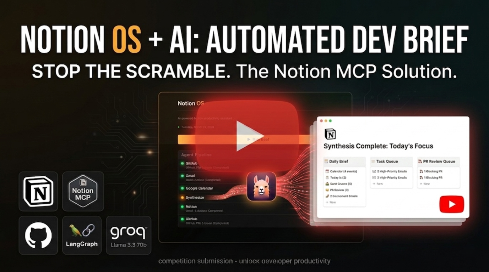
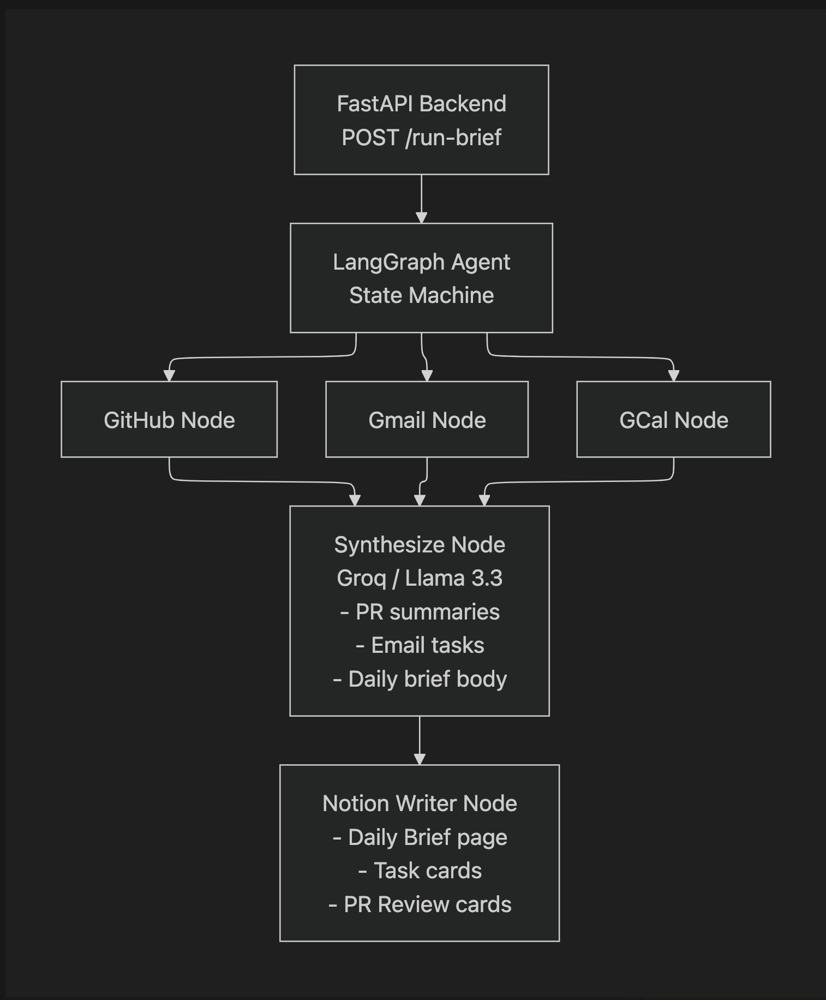

# Notion OS
## Your AI powere Developer Operating system

> One button, One Brief, Your entire day Organized.

[](https://youtu.be/6Bs3JRc3f2I)


## The problem
As an open source contributor, getting up to speed every morning mostly involves opening multiple tabs across different applications; Gmail, GitHub, google calendar  before you've written a single line of code.

A typical morning would go like this:
- 29 unread emails — decide which ones actually need a reply?
- 3 open PRs across 2 repos — which one is blocking someone?
- 4 meetings — did you prep for the 9am standup?
- 6 assigned issues — which one is P0?

## The Solution
Notion Os helps solve this hustle!
Notion Os is a multi-agent pipeline that sweeps across your GitHub, Gmail and Google calendar, synthesizes everything with AI and writes a fully structured briefing into your Notion Workspace before you have your first coffee.


**Three things get written to Notion on every run.**

| Output | Database | What's inside |
|--------|----------|----------------|
|Daily Brief | Daily Briefs | Calendar prep, email actions, PR reviews, issues, Today's Focus |
|Task Cards | Tasks | One card per email action item + GitHub issue, with AI summaries |
|PR Cards | PR Review Queue | One card per open PR with plain-English AI summary |
------------

## Architecture


## Tech Stsck
| Layer | Technology |
|-------|------------|
| Orchestration | [LangGraph](https://github.com/langchain-ai/langgraph) |
| AI Synthesis | [Groq API](https://console.groq.com) — Llama 3.3 70b |
| GitHub Data | GitHub REST API |
| Email Data | Gmail API (OAuth) |
| Calendar Data | Google Calendar API (OAuth) |
| Notion Output | [Notion MCP](https://developers.notion.com) via `mcp` Python client |
| Backend | FastAPI + Python 3.11+ |
| Frontend | Vanilla HTML/CSS/JS |

## Getting Started
### Preruqisites

```bash
python --version   # 3.11+
node --version #18+ (for Notion MCP Server)
```

### 1. Clone the Repo
```bash
git clone https://github.com/lupamo/notion-os
cd notion-os
```

### 2. Install Dependencies
```bash
python -m venv .venv
source .venv/bin/activate 

pip install -r requirements.txt
npm install -g @notionhq/notion-mcp-server
```

### 3. Set up enviroment Variables
```bash
cp .env.example .env
```

Fill in your '.env':
```bash
GROQ_API_KEY=gsk_...         # console.groq.com/keys — free
NOTION_API_KEY=secret_...    # notion.so/my-integrations
GITHUB_TOKEN=github_pat_...  # GitHub -> Settings -> Developer Settings -> PAT
GITHUB_USERNAME=your-username
GITHUB_REPOS=org/repo1,org/repo2 #repos you want to track
```

### 4. Get your API keys

#### Groq (Free)
1. Go to [console.groq.com/keys](https://console.groq.com/keys)
2. Click **Create API Key** → copy it immediately

#### Notion Integration
1. Go to [notion.so/my-integrations](https://www.notion.so/my-integrations)
2. Click **New integration** → name it `Notion OS`
3. Set capabilities: Read, Update, Insert content
4. Copy the **Internal Integration Secret**

#### GitHub PAT
1. GitHub → **Settings** -> **Developer Settings** -> **Personal Access Tokens** -> Fine-grained
2. Permissions: `Issues: Read`, `Pull requests: Read`, `Metadata: Read`

### 5. Setup Norion databases
Create a parent page called **Notion OS** in Notion with these three databases inside it:
**Daily Briefs**
| Property | Type |
|----------|------|
| Title | Title |
| Date | Date |
| Status | Select (`Draft`, `Ready`, `Reviewed`) |
| Energy Level | Select (`High`, `Medium`, `Low`) |
| Open PRs | Number |
| Action Emails | Number |
| Meetings Today | Number |

**Tasks**
| Property | Type |
|----------|------|
| Title | Title |
| Source | Select (`GitHub Issue`, `GitHub PR`, `Email`) |
| Priority | Select (`P0 - Urgent` → `P3 - Low`) |
| Status | Select (`Inbox`, `In Progress`, `Done`) |
| Source URL | URL |
| AI Summary | Rich Text |

**PR Review Queue**
| Property | Type |
|----------|------|
| Title | Title |
| Repo | Select |
| Author | Rich Text |
| Status | Select (`Needs Review`, `Approved`, `Merged`) |
| PR URL | URL |
| Files Changed | Number |
| Lines Changed | Number |
| AI Summary | Rich Text |
| Opened | Date |

For each page: click `...` → **Connections** → select your `Notion OS` integration.

Update `config.py` with your database IDs (found in the Notion page URLs):

```python
NOTION_DAILY_BRIEFS_DB = "your-database-id"
NOTION_TASKS_DB        = "your-database-id"
NOTION_PR_QUEUE_DB     = "your-database-id"
```

---

### 6. Google OAuth (one-time setup)

**Enable APIs in Google Cloud Console:**
1. Go to [console.cloud.google.com](https://console.cloud.google.com)
2. Create a project → enable **Gmail API** and **Google Calendar API**
3. Create **OAuth 2.0 credentials** (Desktop App) → download as `credentials.json` into project root

**Run the auth flow once:**

```bash
python auth_setup.py
```

A browser will open → sign in with your Google account → done. Creates `token.pickle` for all future runs.

---

## Running the App

### Start the server

```bash
uvicorn api.main:app --reload --port 8000
```

### Open the frontend

Open `index.html` in your browser (double-click the file).
